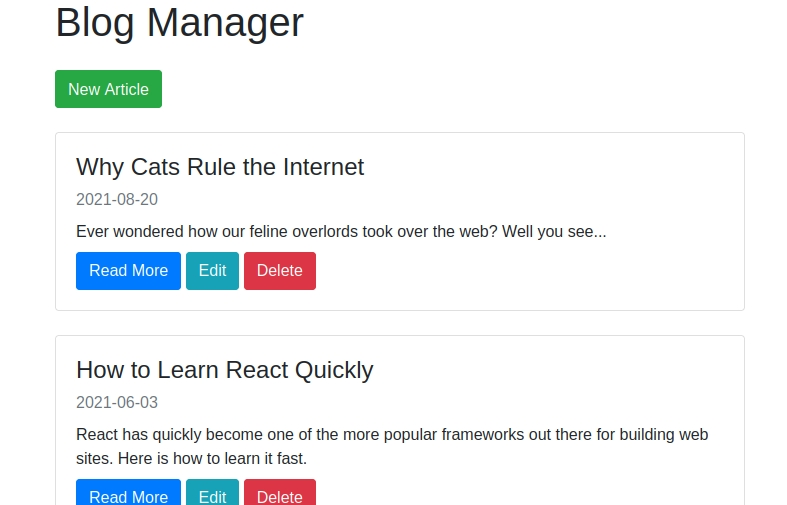

# blog-manager

This is an app that lets you update a blog in your browser, and the data is stored on a MongoDB Atlas cluster. It is intended to be used as the admin panel of a website which also connects to the same DB, such as this one https://github.com/alex-more/my-website. 

## User Guide
The detailed instructions are in the README at https://github.com/alex-more/my-website, but in short, you need to modify server.js to contain your mongodb cluster login details, and have the database setup with an account. 

Also make sure you at least read the section titled *IMPORTANT* at the end of the README there.

## Preview

